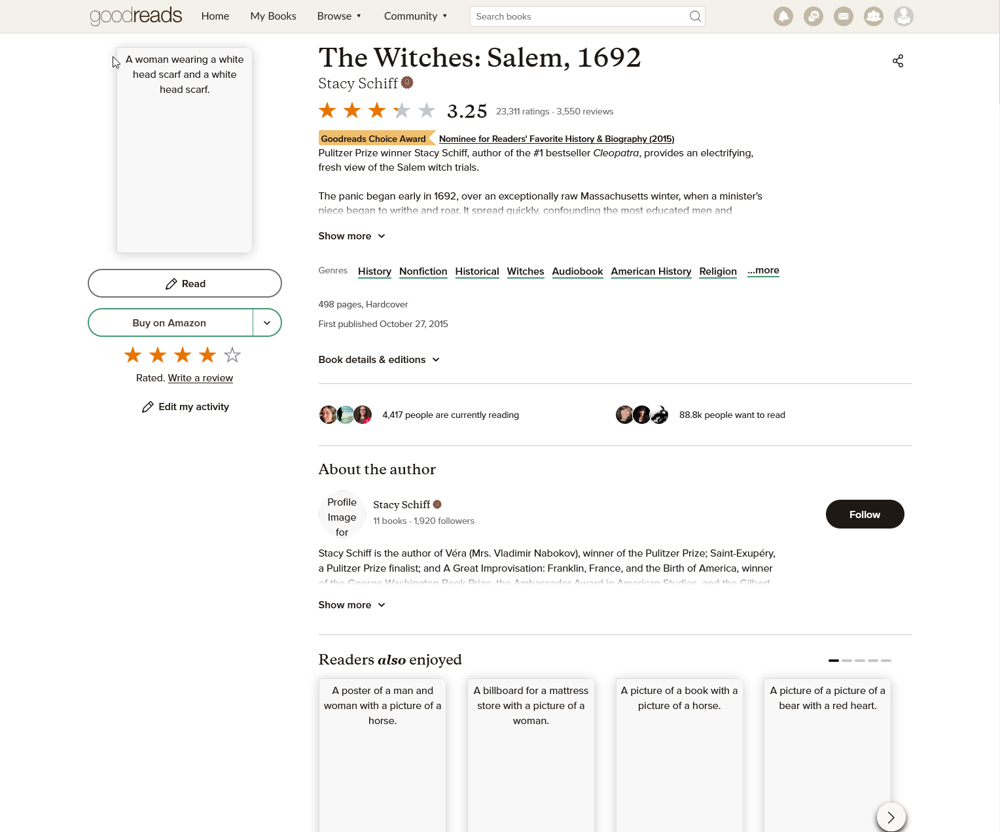
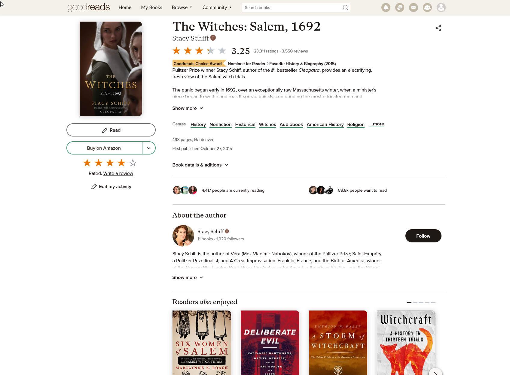
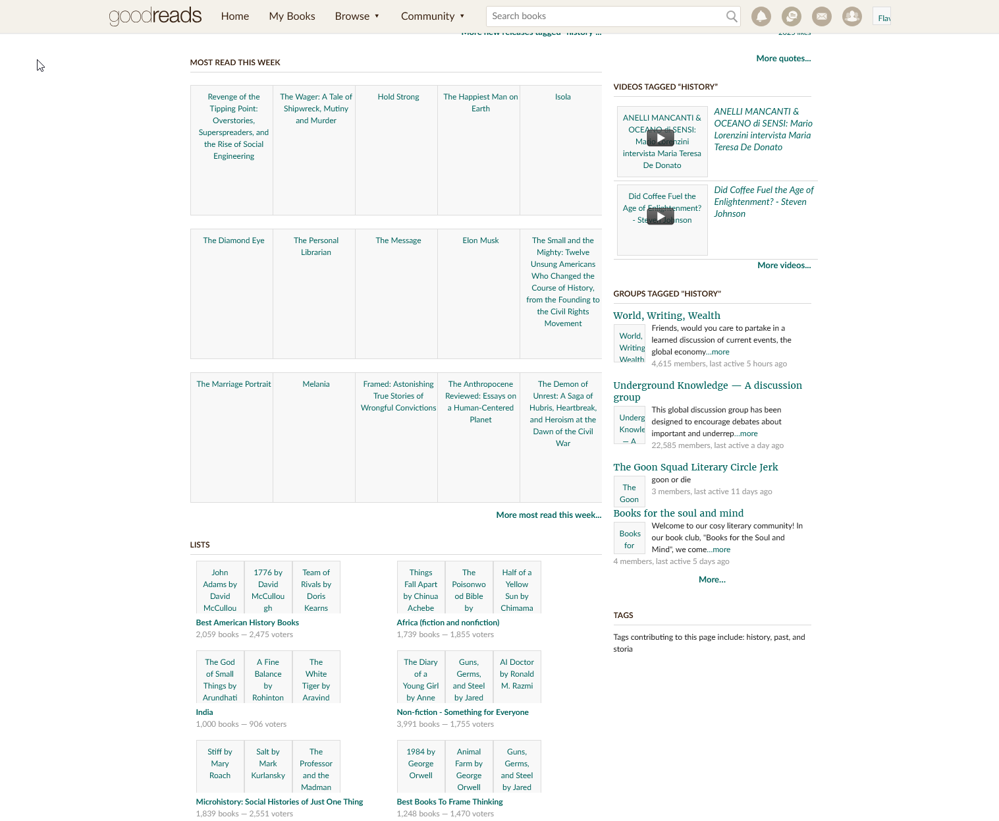

# Never Judge - Goodreads Cover Replacement 📚

**Never Judge** is a Firefox (Nightly) extension that replaces Goodreads book cover images with AI-generated descriptions. It's perfect for those who want to explore books without being influenced by their covers. (Only tested in Firefox Nightly)


## Installation 🛠️

1. Go to https://github.com/robmcelhinney/neverJudge/releases and click on .xpi file.

Or to download it and run it manually

1. Clone this repository:

    ```sh
    git clone https://github.com/robmcelhinney/neverJudge
    cd neverJudge
    ```

2. Load the extension in Firefox Nightly:

    - Open `about:config`
        - browser.ml.enable → true
        - extensions.ml.enabled → true
    - Open `about:debugging#/runtime/this-firefox`.
        - Click "Load Temporary Add-on".
        - Select the `manifest.json` file from this project.
        - Click on `neverJudge` extension and `Permissions` tab
        - Allow `Download and run AI models on your device` permission.

3. Start exploring books without judging by their covers! ✨

## Usage 📖

1. Navigate to Goodreads in Firefox Nightly.
2. The extension will automatically process book cover images as you scroll.
3. Cover images will be replaced with AI-generated descriptions.

## How It Works 🔍

1. **Image Detection**: The extension identifies book cover images on Goodreads pages.
2. **AI Processing**: Each image is sent to the Firefox ML inference API for text generation.
3. **Dynamic Replacement**: The original image is replaced with a styled div containing the generated description.

## Development 🧑‍💻

### Prerequisites

-   Firefox Nightly: Ensure you have the latest version supporting the `ml` permission and `image-to-text` API.

### Debugging

-   Use Firefox's built-in debugging tools for extensions.
-   Check the browser console for logs and error messages.

## License 📜

This project is licensed under the MIT License.

---

## Screenshot

Uses Local AI to get image based on text


Same page - different readers also enjoyed


Uses alt-text where available


## Acknowledgments 🙌

-   Mozilla for providing the ML inference API in Firefox Nightly.
